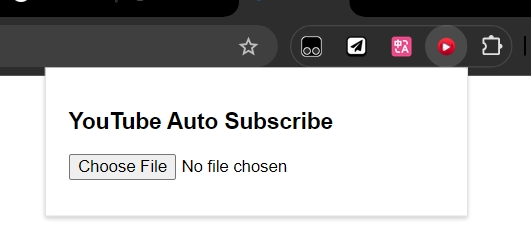

    

  

This tool allows you to automatically subscribe to YouTube channels from a backup CSV file

making it easy to migrate your subscriptions from an old account to a new one.

## How to Use

Follow these steps to transfer your YouTube subscriptions:

1. **Backup Your YouTube Data:**

   - Use Google Takeout to export the YouTube history data from your old account.

2. **Locate the Subscriptions CSV File:**

   - Find the CSV file that contains your subscription information.

3. **Clone This Repository:**

   - Clone this repository to your local machine.

4. **Load the Extension in Chrome:**

   - Go to [Chrome Extensions](chrome://extensions/)  in your browser.
   - Enable "Developer mode" in the top right corner.
   - Click on "Load unpacked" and select the folder where you cloned this repository.

5. **Select the CSV File:**

   - Open the YouTube website.
   - Click on the extension icon in the Chrome toolbar.
   - Choose the path to the CSV file containing your subscriptions.

   

6. **Start the Script:**
   - Wait for the script to execute and subscribe to the channels listed in the CSV file.

## Notes

- Ensure that you are logged into your new YouTube account before running the script.
- The script may take some time depending on the number of subscriptions being processed.

## Troubleshooting

- If you encounter any issues, check the console for error messages and ensure that the CSV file is formatted correctly.
- For any further assistance, feel free to reach out via [Issue Tracker](https://chat.lmsys.org/URL_TO_ISSUE_TRACKER).
