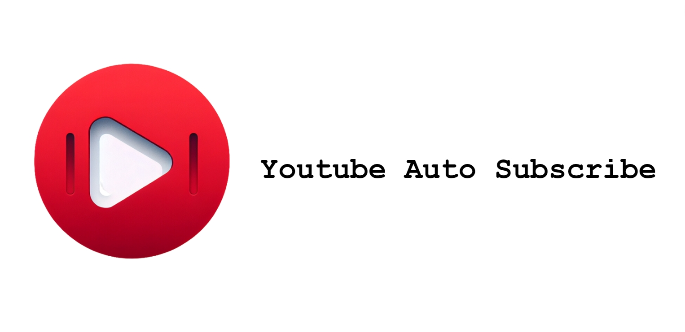
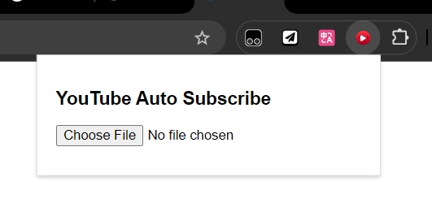

  

This Chrome extension helps you quickly move your YouTube subscriptions and playlists from one account to another using backup CSV files.

## Features

- Transfer subscriptions
- Migrate playlists

## How to Use

### 1. Backup Your Data

Use Google Takeout to export your YouTube data from your old account:

- Subscriptions list
- Playlists data

Not sure what the exported files should look like? See [`examples/`](./examples)
for sample subscription and playlist CSV files and a description of the format.

### 2. Transfer Data

#### For Subscriptions:

1. Open YouTube and log in to your new account
2. Click the extension icon
3. Select your subscriptions CSV file
4. Wait for the process to complete

#### For Playlists:

1. Click "Choose folder" in the Playlists section
2. Select the folder containing your playlist backup CSV files
3. Drink a coffee while the extension creates playlists and adds videos
4. You'll see a completion notification when done

## Notes

- Ensure that you are logged into your new YouTube account before running the script.
- The script may take some time depending on the number of subscriptions being processed.
- **Make sure the YouTube webpage is set to English or Chinese.**

## Having Issues?

If you're experiencing problems, please try these steps:

1. Verify your CSV files (compare against [`examples/`](./examples)):
   - For subscriptions: Use the original channels list from Google Takeout
   - For playlists: Use the playlist CSV files exported by Google Takeout

2. If issues persist:
   - Open an [issue](https://github.com/looechao/YoutubeAutoSubscribe/issues) on Github
   - Include your browser console logs (Press F12 > Console)
   - Describe the steps to reproduce the problem

## Want to contribute? 

Awesome! 🎉

- Found a bug? [Open an issue](https://github.com/looechao/YoutubeAutoSubscribe/issues/new)

- Have an improvement? [Submit a PR](https://github.com/looechao/YoutubeAutoSubscribe/pulls)

If you find this extension helpful, I'd be grateful for your star! ⭐️ 

Thank you for your support! 🙏
